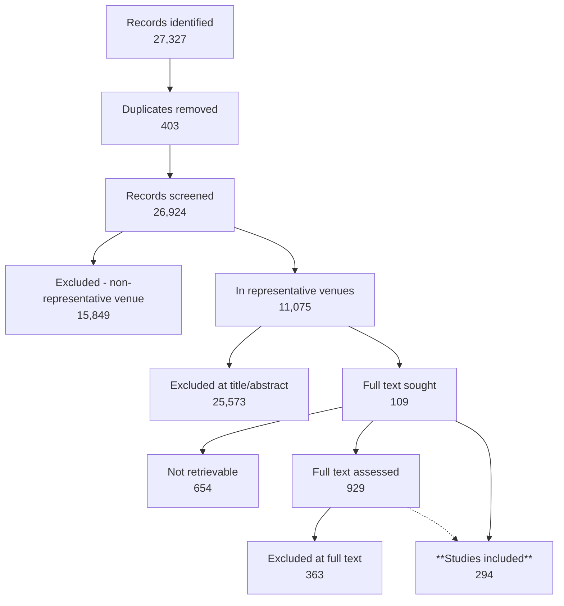

# PRISMA 2020 Flow Report

*Project: `C:\Users\V133280\RMIT University\Thai Pham - StrokeVault\Brain MRI Reconstruction Safety Review - Broad`*

## Identification

*Source: prisma_log.json (recorded by Agent 1 (prisma_counts.py))*

- **Records identified** (all databases): **27,327**
  - By source: PubMed 24,693, Springer 1,598, IEEE Xplore 778, Scopus 127, Semantic Scholar 66, OpenAlex 34, Web of Science 31
- **Duplicate records removed**: 403
- **Records after deduplication (→ screening)**: **26,924**

## Journal/venue filter (representative venues)

*Source: fallback file: C:\Users\V133280\RMIT University\Thai Pham - StrokeVault\Brain MRI Reconstruction Safety Review - Broad\Representative Venues\.filter_state.json*

- **Records evaluated against the venue whitelist**: **26,924**
- **Excluded (non-representative venue)**: 15,849
- **Records in representative venues (→ title/abstract screening)**: **11,075**
- ⚠ Reconstructed directly from C:\Users\V133280\RMIT University\Thai Pham - StrokeVault\Brain MRI Reconstruction Safety Review - Broad\Representative Venues\.filter_state.json — not in prisma_log.json.

## Screening (title/abstract)

*Source: prisma_log.json (recorded by Agent 2 (title/abstract screening, Dat Mai))*

- **Records screened**: **26,924**
- **Excluded**: 25,573
- **Flagged for human review**: 1,040
- **Background/citation-tracking only**: 202
- **Included → next stage**: **109**
- Exclusion reasons:
  - wrong_intervention_or_index: 11,627
  - wrong_population: 9,128
  - out_of_scope: 4,305
  - review_editorial_protocol_commentary: 370
  - wrong_outcome: 79
  - insufficient_information: 57
  - non_english: 6
  - wrong_study_design: 1
- ⚠ Screened the FULL deduplicated pool (26,924). Full text sought = include + flagged = 1149.

## Eligibility — full-text retrieval

*Source: prisma_log.json (recorded by Agent 3 (full_text_retrieval_agent_batch.py))*

- **Full text sought**: **929**
- **Full text obtained** (PDF/HTML/package): 288 PDF, 2 HTML, 1 package
- **Not retrievable (missing full text)**: 654
- Status breakdown:
  - missing_full_text: 654
  - retrieved_pdf: 274
  - retrieved_pdf_html_package: 1
- ⚠  [merged from Full Text Screening/prisma_log.json]

## Eligibility — full-text screening

*Source: prisma_log.json (recorded by Agent 3.5 (full-text screening, Dat Mai + Thu adjudication))*

- **Records screened**: **562**
- **Excluded**: 363
- **Flagged for human review**: 0
- **Background/citation-tracking only**: 14
- **Included → next stage**: **185**
- Exclusion reasons:
  - out_of_scope: 152
  - wrong_intervention_or_index: 120
  - wrong_outcome: 51
  - wrong_population: 35
  - wrong_study_design: 4
  - non_english: 1
- ⚠ 66 initially-flagged records resolved by Thu adjudication (0 remain flagged); 7 records carry needs_human_review within decided categories. Corrupted full text (2 wrong-PDF + 90 boilerplate/thin) cleaned before finalisation.

## Supplementary — author outreach for missing full text

_Not yet run — no data found in prisma_log.json or the fallback report files._

## Summary

- **Studies included in the review: 294**

## Flow diagram

## Not yet run

- Supplementary — author outreach for missing full text

