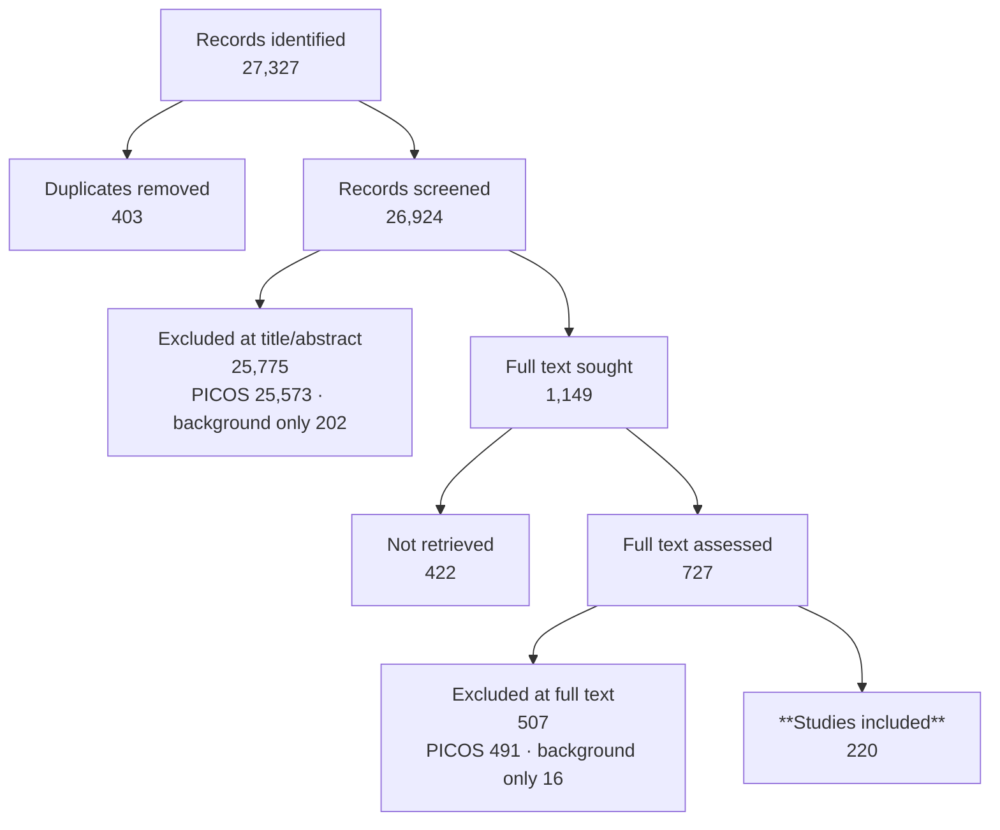

# PRISMA 2020 Flow Report

*Project: `C:\Users\V133280\RMIT University\Thai Pham - StrokeVault\Brain MRI Reconstruction Safety Review - Broad`*

## Identification

*Source: prisma_log.json (recorded by Agent 1 (prisma_counts.py))*

- **Records identified** (all databases): **27,327**
  - By source: PubMed 24,693, Springer 1,598, IEEE Xplore 778, Scopus 127, Semantic Scholar 66, OpenAlex 34, Web of Science 31
- **Duplicate records removed**: 403
- **Records after deduplication (→ screening)**: **26,924**

## Journal/venue filter (representative venues)

*Source: fallback file: C:\Users\V133280\RMIT University\Thai Pham - StrokeVault\Brain MRI Reconstruction Safety Review - Broad\Representative Venues\.filter_state.json*

> **Sensitivity analysis only — not applied as a screening gate.** Title/abstract screening
> covered the full deduplicated pool of 26,924 records, not this 11,075 subset. These counts do
> not sit on the selection path and are excluded from the flow diagram below.

- **Records evaluated against the venue whitelist**: **26,924**
- **In representative venues**: 11,075
- **Not in representative venues**: 15,849
- ⚠ Reconstructed directly from C:\Users\V133280\RMIT University\Thai Pham - StrokeVault\Brain MRI Reconstruction Safety Review - Broad\Representative Venues\.filter_state.json — not in prisma_log.json.

## Screening (title/abstract)

*Source: prisma_log.json (recorded by Agent 2 (title/abstract screening, Dat Mai))*

- **Records screened**: **26,924**
- **Excluded**: 25,573
- **Flagged for human review**: 1,040
- **Background/citation-tracking only**: 202
- **Included → next stage**: **109**
- Exclusion reasons:
  - wrong_intervention_or_index: 11,627
  - wrong_population: 9,128
  - out_of_scope: 4,305
  - review_editorial_protocol_commentary: 370
  - wrong_outcome: 79
  - insufficient_information: 57
  - non_english: 6
  - wrong_study_design: 1
- ⚠ Screened the FULL deduplicated pool (26,924). Full text sought = include + flagged = 1149.

## Eligibility — full-text retrieval

*Source: prisma_log.json (recorded by Agent 3 (full_text_retrieval_agent_batch.py))*

- **Full text sought**: **1,149** (1,040 flagged + 109 included at title/abstract)
- **Full text retrieved and assessed**: **727**
- **Not retrieved**: **422**

Final tally after the original retrieval passes and the **post-registration retrieval round of
2026-08-07**, in which open-access copies were located via Unpaywall/NCBI and 169 further full
texts obtained (165 not previously assessed + 4 re-retrievals whose original decisions were
confirmed unchanged against complete text). Reconciles with
`../4_Screening_Decisions/abstract_screening_decisions.csv`,
`../4_Screening_Decisions/fulltext_screening_decisions.csv` (562 rows), and
`../4_Screening_Decisions/fulltext_screening_decisions_round2.csv` (169 rows), and matches
the PRISMA figure in the manuscript.

**Why the remaining 422 could not be retrieved:** 9 are PMC-embargoed (public release dates
2026-10-28 through 2027-07-01); 1 title is not licensed to the reviewers' institution (Karger);
1 open-access-flagged record had no locatable accessible copy; the remainder (411) have no
open-access copy per Unpaywall and no institutional subscription access. Document-delivery
requests remain possible for the subscription-only titles.

Intermediate batch, 2026-07-27 14:20 UTC — superseded, retained for provenance

One run of `full_text_retrieval_agent_batch.py` over the `Include` and `Flagged` folders as they
stood at that time. Later retrieval passes supersede it.

- Screened for retrieval: 929
- Status breakdown: missing_full_text 654 · retrieved_pdf 274 · retrieved_pdf_html_package 1
- Files on disk at that point: 288 PDF, 2 HTML, 1 package — file counts, not record statuses,
  which is why 288 exceeds the 274 records marked `retrieved_pdf`.

## Eligibility — full-text screening

*Source: prisma_log.json (recorded by Agent 3.5 (full-text screening, Dat Mai + Thu adjudication))*

- **Records screened**: **727** (562 original + 165 newly retrieved; a further 4 re-retrievals
  confirmed their original decisions)
- **Excluded**: 491
- **Flagged for human review**: 0
- **Background/citation-tracking only**: 16
- **Included → next stage**: **220**
- Second full-text screening round (2026-08-07), recorded in
  `fulltext_screening_decisions_round2.csv`: 169 screened → 36 include (35 new),
  131 exclude (128 new), 2 background_only; 10 flagged records adjudicated
- Exclusion reasons:
  - out_of_scope: 152
  - wrong_intervention_or_index: 120
  - wrong_outcome: 51
  - wrong_population: 35
  - wrong_study_design: 4
  - non_english: 1
- ⚠ 66 initially-flagged records resolved by Thu adjudication (0 remain flagged); 7 records carry needs_human_review within decided categories. Corrupted full text (2 wrong-PDF + 90 boilerplate/thin) cleaned before finalisation.

## Supplementary — author outreach for missing full text

_Not yet run — no data found in prisma_log.json or the fallback report files._

## Summary

- **Studies included in the review: 220**
- Cited as background/context only, not counted among the 185: 14 at full text, 202 at
  title/abstract

## Flow diagram

## Not yet run

- Supplementary — author outreach for missing full text

